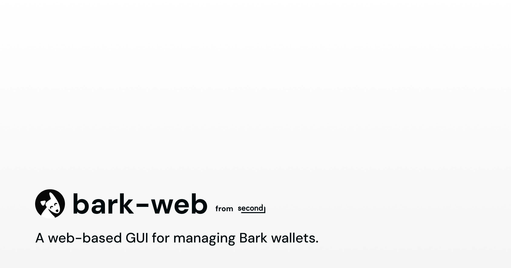

<div align="center">
<h1>bark-web</h1>
<p>A web-based graphical user interface for managing Bark wallets</p>
</div>

## Getting started

### Requirements

- [node v22+](https://nodejs.org/)
- [docker](https://www.docker.com/products/docker-desktop/)

### Setup

1. Install the dependencies with `npm`:

```bash
npm install
```

2. Create `.env.local` at the root of the repository and add the required environment variables.

Take a look at the `.env.example` file.

### Run

Make sure you have `Docker Desktop` running and execute the following command:

```bash
npm run dev
```

The application will be running on `http://localhost:5173`.

To stop, run `docker compose down`.

### Reset / Start from Scratch

Remove all containers and the shared `wallet-data` volume to start with a clean state:

```bash
docker compose --env-file .env.local down -v
```

Then run `npm run dev` again.

### Lint and Format

We use [ultracite](https://docs.ultracite.ai/) with [oxlint](https://oxc.rs/docs/guide/usage/linter) and [oxfmt](https://oxc.rs/docs/guide/usage/formatter) for the linting and formatting.

Run linter checks without modifying files:

```bash
npm run check
```

Run the linter and auto-fix issues:

```bash
npm run fix
```

## Contributing

Thinking of opening a pull request? See our [contribution guide](CONTRIBUTING.md) for dependencies, style guidelines, and code hygiene expectations.

## License

Released under the **MIT** license — see the [LICENSE](LICENSE) file for details.
