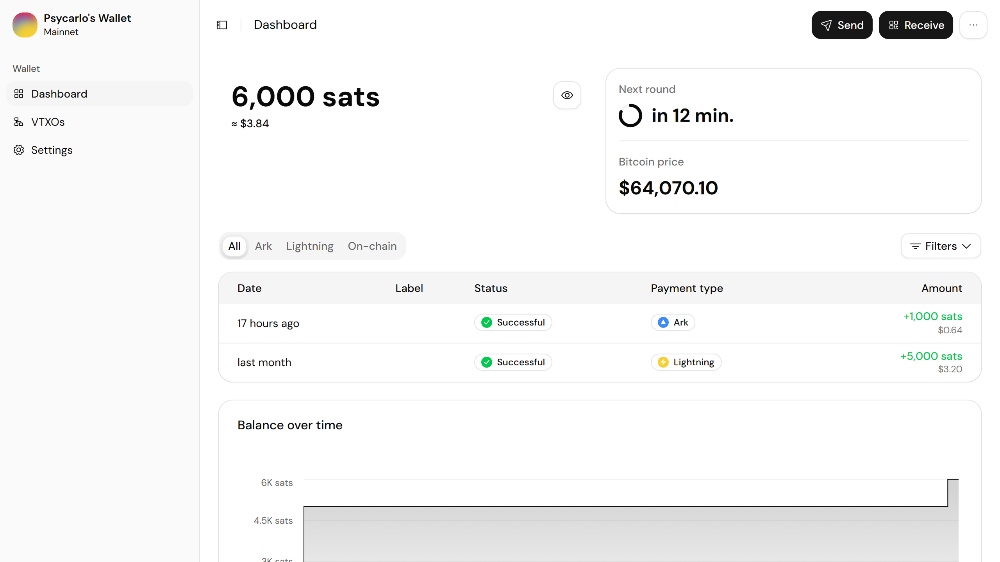
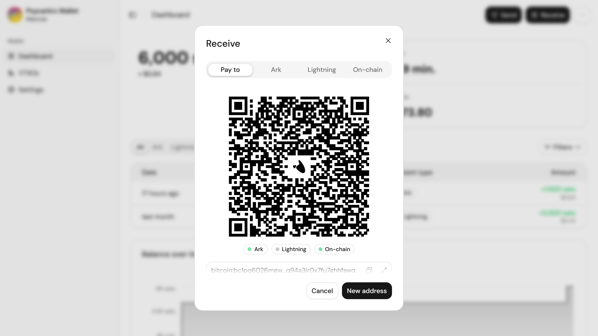
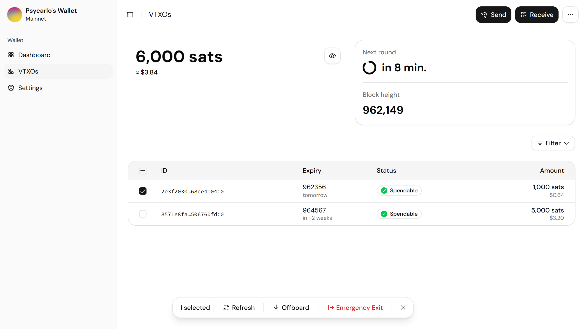
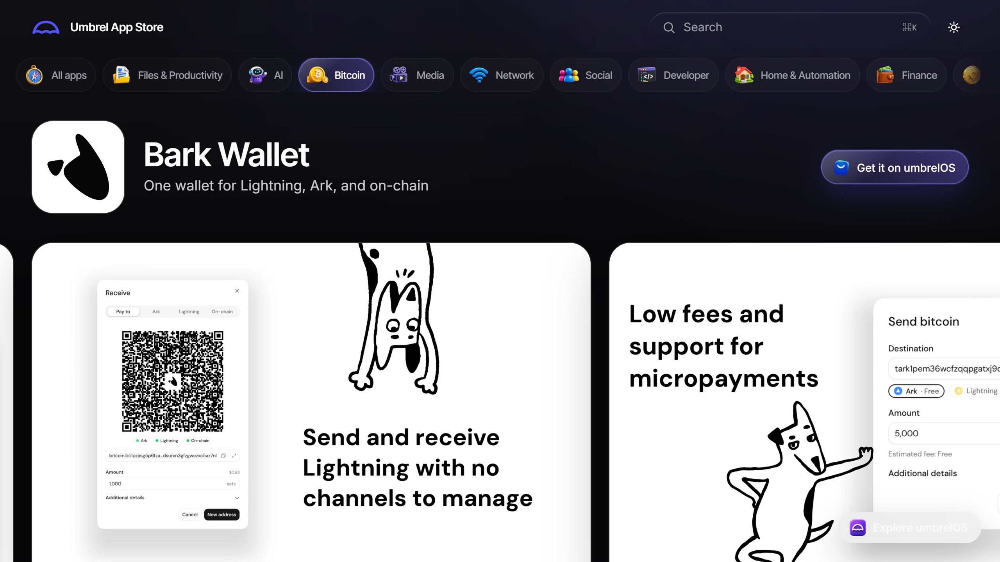
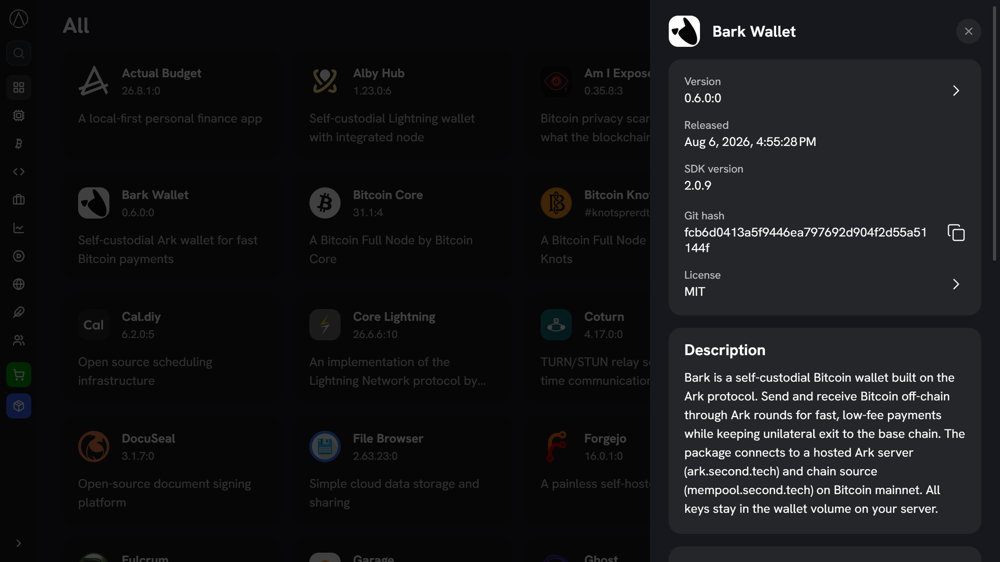

<div align="center">
<h1>bark-web</h1>
<p>A web-based graphical user interface for managing Bark wallets</p>
</div>

## Screenshots

<details>
<summary>Show screenshots</summary>

<br />











</details>

## Getting started

### Requirements

- [node v22+](https://nodejs.org/)
- [docker](https://www.docker.com/products/docker-desktop/)

### Setup

1. Install the dependencies with `npm`:

```bash
npm install
```

2. Pick an environment file. The repo ships two committed presets:

- `.env.signet`
- `.env.mainnet`

You can use them directly via the shortcuts below, or copy one to `.env.local` and tweak for custom setups. See `.env.example` for the full set of variables.

### Run

Make sure you have `Docker Desktop` running. Then pick a network. Use `signet` for testing, `mainnet` for real bitcoin:

```bash
npm run dev:signet     # docker compose --env-file .env.signet up --build
npm run dev:mainnet    # docker compose --env-file .env.mainnet up --build
npm run dev            # docker compose --env-file .env.local up --build
```

The application will be running on `http://localhost:5173`. At boot it fetches its runtime config (Ark server, chain source, network) from `GET /api/config`.

To stop, use the matching down script (containers stop, wallet data persists):

```bash
npm run down:signet    # docker compose --env-file .env.signet down
npm run down:mainnet   # docker compose --env-file .env.mainnet down
npm run down           # docker compose --env-file .env.local down
```

If you already have a `barkd` running, you can launch just the web UI against it.

1. Copy the example env file and fill in your barkd's details:

```bash
cp .env.byob.example .env.byob
```

2. Start the web UI:

```bash
npm run dev:byob
```

### Reset / start from scratch

Each network uses its own docker volume (via `COMPOSE_PROJECT_NAME`), so wipe the one you used:

```bash
docker compose --env-file .env.signet down -v
docker compose --env-file .env.mainnet down -v
```

Then run `npm run dev:signet` (or `:mainnet`) again.

### WASM mode (no daemon)

The app can also run the wallet entirely in the browser on [`@secondts/bark`](https://www.npmjs.com/package/@secondts/bark), with no `barkd` and no server. Wallet state lives in IndexedDB and the browser talks to the Ark server and esplora directly.

1. Copy the example env file:

```bash
cp .env.wasm.example .env.wasm
```

2. Run it, or build a static bundle:

```bash
npm run dev:wasm       # vite --mode wasm
npm run build:wasm     # static site in dist/
```

Expired coins are checked against the server in barkd mode with the `adopt-server-status` route. A coin the server paid out on-chain is marked spent, and the payout arrives as an ordinary receive in the on-chain wallet. The `@secondts/bark` 0.24.0 bindings lack that call, so WASM mode skips the check and expired coins stay _Renewing_.

Creating a wallet with Bitcoin Core also requires the fork's `fresh_mnemonic`
request field. The create screen marks its newly generated seed so barkd starts
scanning at the current tip. Importing an existing seed keeps its supplied birth
height and never sets that flag.

### Bump bark versions

Use the helper script to bump bark/barkd versions:

```bash
bash scripts/bump-bark-version.sh <new-version>
```

### Lint and format

We use [ultracite](https://docs.ultracite.ai/) with [oxlint](https://oxc.rs/docs/guide/usage/linter) and [oxfmt](https://oxc.rs/docs/guide/usage/formatter) for the linting and formatting.

Run linter checks without modifying files:

```bash
npm run check
```

Run the linter and auto-fix issues:

```bash
npm run fix
```

## Tech stack

- [Vite](https://vite.dev/) — build tool and dev server
- [React](https://react.dev/) — UI library
- [shadcn/ui](https://ui.shadcn.com/) — component library
- [TanStack](https://tanstack.com/) — Query and Table
- [Zustand](https://zustand.docs.pmnd.rs/) — state management
- [Zod](https://zod.dev/) — runtime config and schema validation
- [Hono](https://hono.dev/) — HTTP server for the bark-web API
- [nginx](https://nginx.org/) — static asset server and reverse proxy in the production image
- [barkd](https://www.npmjs.com/package/@secondts/barkd) — Bark daemon client
- [bark](https://www.npmjs.com/package/@secondts/bark) — in-browser WASM wallet bindings, used in WASM mode
- [Branta](https://branta.pro/) — wallet address verification

## Contributing

Thinking of opening a pull request? See our [contribution guide](CONTRIBUTING.md) for dependencies, style guidelines, and code hygiene expectations.

## License

Released under the **MIT** license — see the [LICENSE](LICENSE) file for details.
